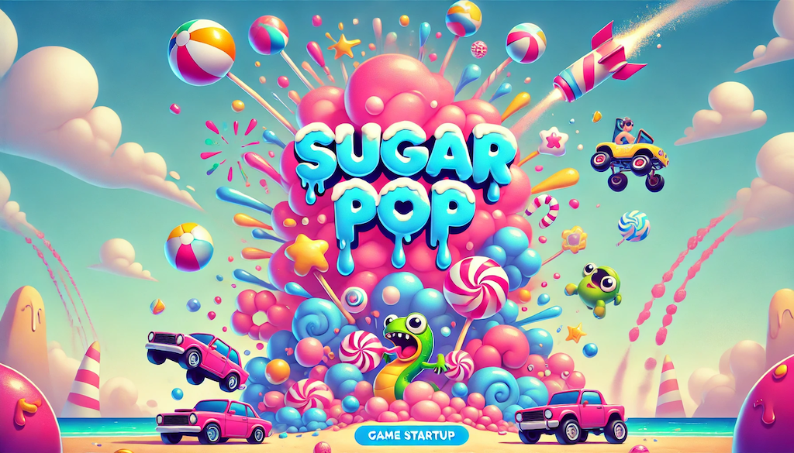

# SugarPop
This final project was developed by the [2024 Introduction to Programming class at Principia College](https://www.principiacollege.edu/academics/majors/computer-science) (www.principia.edu).  Enjoy and send us your feedback.  What was the hardest level?

## Installation
The following must be installed to get this program to work:
- Python 3 (Google 'python install' for download and instructions)
- Pygame
    `pip install pygame`
- Pymunk
    `pip install pymunk`

Use the mouse to draw walls
 ~AND~
- 'r' to restart the level
- 'p' to pause
- 'm' to mute
- other 'secret' keys

©2024 Brett W Huffman